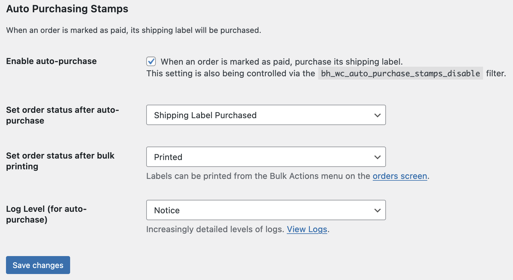
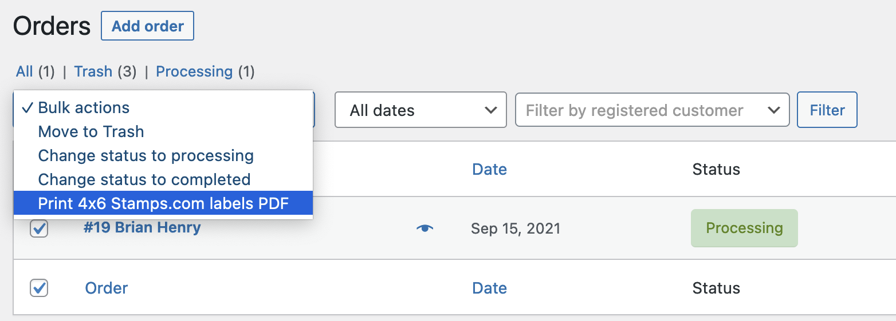
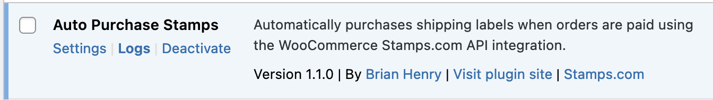

[](https://wordpress.org/plugins/bh-wp-plugins-page) [](https://github.com/szepeviktor/phpstan-wordpress) [](https://brianhenryie.github.io/bh-wp-plugins-page/) 

# Auto Purchase Stamps.com

An add-on for [WooCommerce Stamps.com API](https://woocommerce.com/products/woocommerce-shipping-stamps/) plugin to allow auto-purchasing and bulk-printing.

When an order is marked processing it uses the Stamps.com plugin to purchase the label as normal.







```php
/**
 * Disable for wholesale orders
 * 
 * @param bool $disable Should auto-printing be disabled for this order?
 * @param WC_Order $order The order object.
 * @return bool
 */
add_filter( 'bh_wc_auto_purchase_stamps_disable', function( bool $disable, WC_Order $order ): bool {
    return $disable || 'wholesale' === $order->get_meta( '_wwpp_order_type' );
},10,2);
````

## TODO

* Customs.
